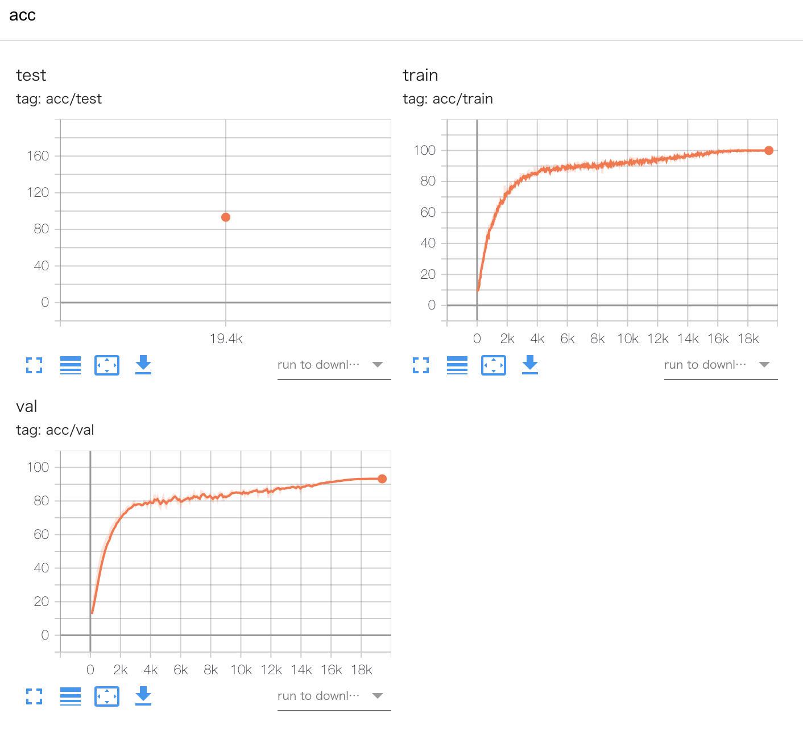

# PyTorch-Lightning-CIFAR10
"Not too complicated" training code for CIFAR-10 by PyTorch Lightning

This is a refactored repository of [huyvnphan/PyTorch_CIFAR10](https://github.com/huyvnphan/PyTorch_CIFAR10). I'm glad if you can use it as a reference.

## Dataset

Details of CIFAR-10 can be found at the following link. [CIFAR-10 and CIFAR-100 datasets](https://www.cs.toronto.edu/~kriz/cifar.html)

## PyTorch Environment

I am using the following PyTorch environment. I haven't used it yet because it has changed a lot in ``torch==1.9.0``. See `Pipfile` or `requirements.txt` for more information.

* torch==1.8.0
* torchvision==0.9.0
* pytorch-lightning==1.3.8

## Instalation

I run in the following environment. If you have a similar environment, you can prepare the environment immediately with pipenv.

* Ubuntu 20.04.1 LTS
* CUDA Version 11.0
* Python 3.8.5

```
pip install pipenv
pipenv sync
```

If you do not have a cuda environment, please use Docker. Build docker with the following command.

```
docker-compose up -d dev
```

Run docker with the following command.

```
docker run --rm -it --runtime=nvidia \
    -v /mnt/:/mnt \
    -v /mnt/nfs/kuroyanagi/clones/PyTorch-Lightning-CIFAR10/:/work/PyTorch-Lightning-CIFAR10 \
    -u (id -u):(id -g) \
    -e HOSTNAME=(hostname) \
    -e HOME=/home/docker \
    --workdir /work/PyTorch-Lightning-CIFAR10 \
    --ipc host \
    pytorch-lightning-cifar10 bash
```

### Prepare dataset

This repository is implemented in two ways, one is to load CIFAR-10 from **torchvision** and the other is to load CIFAR-10 as a **custom dataset**. I want you to use it as learning how to use custom dataset.

If you want to load CIFAR-10 from **torchvision**, specify config as follows.

```
dataset:
  loading: 'torchvision'
```

If you want to load CIFAR-10 as a **custom dataset**, download the raw image as shown below.

```
cd data/
bash download_cifar10.sh # Downloads the CIFAR-10 dataset (~161 MB)
```
Also, specify config as custom for loading.

```
dataset:
  loading: 'custom'
```

### Modeling

The following three methods are available for modeling.

* **Scratch implementation** resnet18, resnet32, resnet50
* **timm**

When using the scratch implementation of resnet, specify config as follows.

```
model:
  classifier: 'resnet18'
  implementation: 'scratch'

transform:
  normalization: 'cifar10'
```

When using timm's imagenet pretrained model, specify config as follows.

```
model:
  classifier: 'resnet18'
  implementation: 'timm'
  pretrained: True

transform:
  normalization: 'imagenet'
```

### Train

`train.py` performs training/validation according to the specified config. The checkpoint is saved in the best epoch that monitors the accuracy of validation.

To execute the experiment of `configs/experiments/train_exp01.yaml`, execute as follows. Specify the output destination as `hydra.run.dir=outputs/train_exp01`.

```
pipenv run python train.py +experiments=train_exp01 hydra.run.dir=outputs/train_exp01
```

If you use Docker, execute the following command.

```
export TORCH_HOME=/home/docker
python train.py +experiments=train_exp01 hydra.run.dir=outputs/train_exp01
```

### Test

Specify `evaluate: True` in config as shown below.

```
runs:
  evaluate: True
```
You can run test with the same code as train.

```
pipenv run python train.py +experiments=test_exp01 hydra.run.dir=outputs/test_exp01
```

The following results are obtained.

```
Global seed set to 0
GPU available: True, used: True
TPU available: None, using: 0 TPU cores
LOCAL_RANK: 0 - CUDA_VISIBLE_DEVICES: [0]
Testing: 100%|████████████████████████████████████████| 19/19 [00:03<00:00,  5.88it/s]
--------------------------------------------------------------------------------
DATALOADER:0 TEST RESULTS
{'acc/test': 93.1743392944336}
--------------------------------------------------------------------------------
```

### Results

The results of TensorBoard are as follows.



### References

* [huyvnphan/PyTorch_CIFAR10](https://github.com/huyvnphan/PyTorch_CIFAR10)

### TODOs

- [x] check code format with black, isort, vulture.
- [x] Docker and pipenv.
- [x] GPU usage for custom dataset and light weight model(resnet18, MobileNetV3) does not remain high. => GPU usage remained high (100%) when loaded from AWS EBS instead of AWS EFS.
- [x] In ``evaluate: True``, Accuracy is a strange value. => It was solved by loading properly with load_from_checkpoint. See also [In load_from_checkpoint, "TypeError: __init__ () missing 1 required positional argument:'cfg'" · Discussion #8289 · PyTorchLightning/pytorch-lightning](https://github.com/PyTorchLightning/pytorch-lightning/discussions/8289).
- [] Fine tuning by torchvision's pretrained model
- [] Integration of hydra color logger and PyTorch Lighting logger (Probably not possible).
